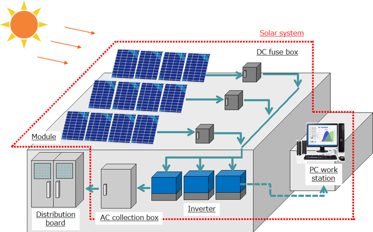
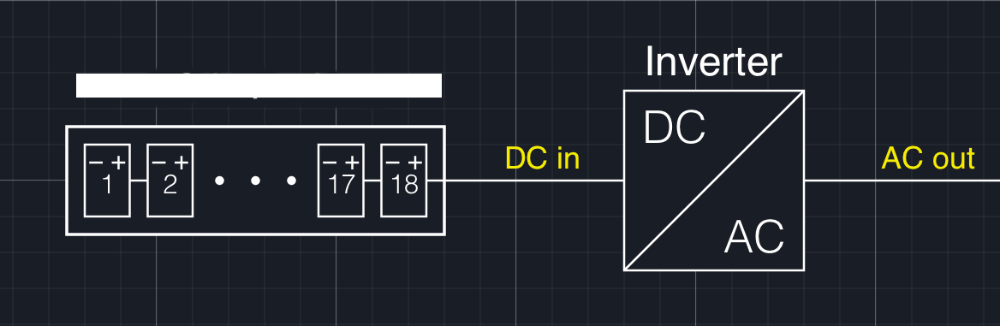

PV Solar Power Plant:
=====================

 

**Long story short**: When a photon hits the surface of the photovoltaic cell, its energy is transferred to the electrons present on the silicon cell. These electrons are "excited" and begin to flow in the circuit producing electric current. A solar panel produces Direct Current energy,(DC power). Then, it's up to the inverter to convert it into alternating current to transport it and use it in our distribution networks. In fact, domestic and industrial buildings are designed for the transport and use of alternating current. 

**Every solar power plant consists at least of two basic components:** 
- Modules- that convert sunlight into electricity 
- One or more inverters- devices that convert direct current into alternating current. 

 

Typically the factors that determine the performance of a solar power plant are: Temperature Dirtiness Inverters Efficiency Inverters or panels seniority So where are the challenges? In this project we will answer two main question: 

- Can we identify abnormalities factor that affect the solar power system? The factor here can be bad weather or the faulty of a equipment. 
- Can we predict the power generation for next couple of days? - this allows for better grid management

Project outline
===============

*   🔆 **Data visualize analysis:** Provide a picture of solar power generation regarding the weather and time.
*   💢 **Fault/Abnormalities Analysis:** Provide a picture of relationship between solar power generation and weather.
*   📈 **Solar power forecasting:** Solar power forecasting is the process of gathering and analyzing data in order to predict solar power generation on various time horizons with the goal to mitigate the impact of solar intermittency. Solar power forecasts are used for efficient management of the electric grid and for power trading.

Data Description
================

### Plant 1 Generation Data:

*   📅 DateTime: Date and time of data recording.
*   🔑 Source Key: Unique identifier for inverters.
*   ⚡ DC Power & AC Power: Metrics showing the direct and alternating current outputs.
*   🌞 Daily Yield & Total Yield: Values capturing both daily and cumulative energy generation.

### Plant 1 Weather Sensor Data:

*   🌡️ Ambient Temperature & Module Temperature: Indicators of environmental and equipment conditions.
*   🌞 Irradiation: Reflecting the sunlight received by panels.

### Plant 2 Generation Data:

*   📅 DateTime: Detailed timestamps for granular temporal study.
*   🔑 Source Key: A gauge for variation in performance across inverters.
*   ⚡ DC Power & AC Power: Insights into the conversion rates and overall panel performance.
*   🌞 Daily Yield & Total Yield: Metrics detailing the range of energy production.

### Plant 2 Weather Sensor Data:

*   🌡️ Ambient Temperature & Module Temperature: Parameters affecting energy generation efficacy.
*   🌞 Irradiation: A critical measure of sunlight exposure.

With thousands of observations, this combined dataset is a treasure trove for anyone looking to understand the intricacies of solar energy production and the myriad of factors influencing it.